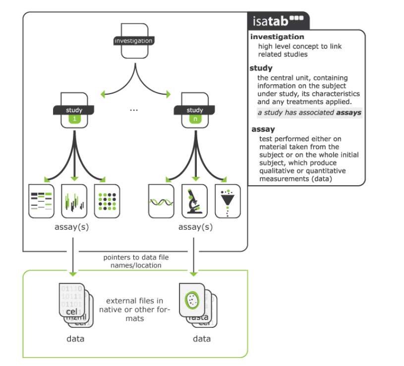

# Overall structure of the excel workbook

The workbook is based on the Investigation/Study/Assay (ISA) Metadata
Framework (see [@fig-isa]), a well-recognised hierarchal framework with a
set of community specifications to support provision of "*rich
descriptions of experimental metadata (i.e., sample characteristics,
technology and measurement types, sample-to-data relationships) so that
the resulting data and discoveries are reproducible and reusable*".[^4]
The ISA framework is used in reporting data generated from experiments
in the life sciences and environmental fields, e.g., [**Harvard Medical
School LINCS Database**](http://lincs.hms.harvard.edu/data/isa-tab/),
[**MetaboLights**](http://www.ebi.ac.uk/metabolights/about). In addition
to following the ISA approach for experimental metadata, the excel
workbook also contains additional fields in each of the files
(investigation, study, assay) to fulfil PARC's ambitions of "increased
re(use) of scientific and regulatory data" and "one substance = one
assessment".

{#fig-isa} 

**Mapping ISA to the PARC context:**

The **Investigation module** will contain metadata of a particular
project within WP5 and will contain all the information needed to
understand the overall goals of a project, the project context, the
people leading the project, and outputs or associated publications (of
data -- deposited in repositories, journal articles, PARC deliverable(s)
in which the data is reported etc.)

The **Study module** **is a unit of research which supports the overall
project goal**. The provenance of the test system (i.e., details of cell
lines), test substances/materials and exposure duration, including names
of researchers involved in performing the experiments are collected in
this sheet. Both Investigation and Study have contact person names,
their roles, and affiliation assigned as this is considered essential
provenance information. The study module has further excel sheets based
on each of the cells (including primary cells)/ cell lines utilised, as
shown schematically in [@fig-isa-parc] where the study has multiple components
(endpoints) (e.g., neurotoxicity, immunotoxicity etc., and each endpoint
is evaluated in multiple cell types.

The **Assay Module** contains the details of analytical endpoints of the
test system, including measurement instruments and data transformation
approaches explained briefly. The assay sheet produces the data
(qualitative or quantitative).

![ISA-tab structure as applied to PARC using the WP5 project P5.1.1.b_Y1_BPA_HumTox_BfR as an example. The schematic shows the overall approach of arranging the project and associated experimental metadata into the hierarchical framework of investigation (specific WP5 project), study (an activity within the project) and assay (test done to produce quantitative or qualitative measurements). The project file/excel sheet in a study workbook will be the first sheet in all study workbooks as it will be directly linked to the overarching PARC DMP and the PARC reporting on FAIR research outputs.](images/guide/image3.png){#fig-isa-parc}

The fields in the workbook have been modelled on the following
resources:

1.  NANoREG templates[^5]
2.  EU‑ToxRisk Project[^6]
3.  OECD Guidance Document on Good In Vitro Method Practices
    (GIVIMP)[^7]
4.  OECD Harmonised Templates (especially OHT 201[^8])
5.  Guidance document on Good Cell and Tissue Culture Practice 2.0 (GCCP
    2.0)[^9]

The data completeness for each experiment is judged differently (and
especially for reproducibility) -- both in a quantitative and in a
qualitative sense, for example, quality acceptance criteria for source
cell populations, test system at start and end of exposure adds robust
information to aid in reproducibility, however, we are limiting the
information needs for pragmatic reasons (as we would otherwise be stuck
with no data at all). We are aiming to collect detailed information in
the Excel workbook/sheet tabs "TestSubstance", "Action", etc.[^10],
which is one time information, and a summary of results (with key
information) is included in the final "AssaySummaryResults" sheet to
make it easy to understand the reporting of the relevant experimental
conditions. The summary results dataset will give an overview of the
experiment to enable potential re-users of the data to make a decision
on whether the data will be useful for testing a hypothesis and the
utility of related datasets (processed, raw) for other research
purposes, without needing to dig into all of the details. We have
avoided including project and study metadata fields in the summary
sheet, to make the table not too complicated, for example, information
that can be found in the Standard Operating Procedures (SOPs) of the
assays was not included in the AssaySummaryResults sheet as it would
mean repeating rows with the same information. Moreover, the data
requirements in the template are also aligned with the questions in the
PARC data management plan.

Each WP5 project (i.e., investigation) will contain several activities
(i.e., studies, to align with the ISA Framework) and each study may
contain several endpoints (e.g., cell death, genotoxicity,
immunotoxicity etc.) whose metadata and data need to be integrated to
address the specific goals of the project. Within the particular project
(used in the example here - WP5 project P5.1.1.b_Y1_BPA_HumTox_BfR,
experiments related to neurotoxicity can be Study 1, immunotoxicity can
be Study 2, so on and so forth, as shown schematically in [@fig-isa-parc]. This
approach, in our perspective, helps in defining a self-contained unit of
research. Additionally, the protocols, guidance documents (e.g., IL2
Test Guidelines for *in vitro* immunotoxicity[^11]), test system, etc.
which are followed would be specific to the field/experiments, and not a
mix of many experimental objectives and test methodologies[^12]. Thus,
each study will have an excel workbook, with specific assays measuring
analytical endpoints as worksheets. The excel sheets (i.e., module),
"Project", and "Action" will have fields which detail the necessary
metadata associated with the data for uploading in various repositories
and/or to the PARC CRA Hub.

[^4]: Available at: <https://isa-specs.readthedocs.io/en/latest/>
    Accessed 16 November 2024

[^5]: Totaro S; Crutzen H; Riego Sintes J. Data logging templates for
    the environmental, health and safety assessment of nanomaterials .
    EUR 28137 EN. Luxembourg (Luxembourg): Publications Office of the
    European Union; 2017. JRC103178. Available at:
    <https://publications.jrc.ec.europa.eu/repository/handle/JRC103178>.
    Accessed on: 03/12/2024

[^6]: Krebs, A. (2019) "Template for the description of cell-based
    toxicological test methods to allow evaluation and regulatory use of
    the data", *ALTEX - Alternatives to animal experimentation*, 36(4),
    pp. 682--699. doi: 10.14573/altex.1909271.; Krebs A, van
    Vugt-Lussenburg BMA, Waldmann T, et al. The EU-ToxRisk method
    documentation, data processing and chemical testing pipeline for the
    regulatory use of new approach methods. *Arch Toxicol*.
    2020;94(7):2435-2461. doi:10.1007/s00204-020-02802-6

[^7]: OECD (2018), *Guidance Document on Good In Vitro Method Practices
    (GIVIMP)*, OECD Series on Testing and Assessment, No. 286, OECD
    Publishing, Paris. Available at:
     <https://doi.org/10.1787/9789264304796-en>. Accessed on:
    03/12/2024; OECD (2025); Guidance Document on Good In Vitro Method
    Practices (GIVIMP), Second Edition, OECD Series on Testing and
    Assessment, No. 421, OECD Publishing, Paris,
    https://doi.org/10.1787/5ba6777b-en.

[^8]: Available at:
    <https://www.oecd.org/en/topics/assessment-of-chemicals/harmonised-templates-intermediate-effects.html>.
    Accessed on: 22/12/2025

[^9]: Pamies, D., et al. (2022). "Guidance document on Good Cell and
    Tissue Culture Practice 2.0 (GCCP 2.0)." ALTEX - Alternatives to
    animal experimentation 39, 30--70.
    <https://doi.org/10.14573/altex.2111011>
    
    [^10]: The information on Manufacturer, Batch/lot numbers, etc. are
    being asked only once. The rationale for asking such data (though
    extensive) could help to provide preliminary explanation of
    technical batch effects, uncertainties of test method, some of the
    Quality Control (QC) aspects of in vitro experiments and help to
    understand whether the data made available can be used for risk
    assessment and/or what information and modifications (e.g., data
    processing steps, additional data) would be needed to complete a
    risk assessment.

[^11]: OECD (2023), *Test No. 444A: In Vitro Immunotoxicity: IL-2 Luc
    Assay*, OECD Guidelines for the Testing of Chemicals, Section 4,
    OECD Publishing, Paris

[^12]: Test method here include the components: test system, endpoint,
    exposure scheme, prediction model.
